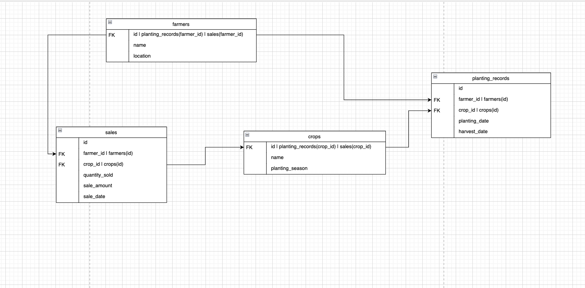

# Farmers Solution

## DB Design

## Overview

This project is designed to manage records for farmers, from planting to sales. The database tracks information about farmers, the crops they plant, planting records, and sales.

## Database Structure

The database consists of four main tables:

1. **Farmers**: Stores information about each farmer.
2. **Crops**: Stores information about different types of crops.
3. **Planting Records**: Stores records of when crops were planted and harvested by each farmer.
4. **Sales**: Stores records of crop sales, including the quantity sold and the sale amount.

## SQL Procedures

The project includes several SQL procedures for more complex queries:

- **GetSalesDetails**: Retrieves sales details, including farmer and crop names.
- **GetPlantingRecords**: Retrieves planting records with farmer and crop names.
- **GetTotalSalesPerFarmer**: Calculates the total sales amount for each farmer.

## How to Use

1. Set up the database using the `schema.sql` file.
2. Populate the database with sample data using the `data.sql` file.
3. Execute the procedures in `procedures.sql` to retrieve and analyze data.
